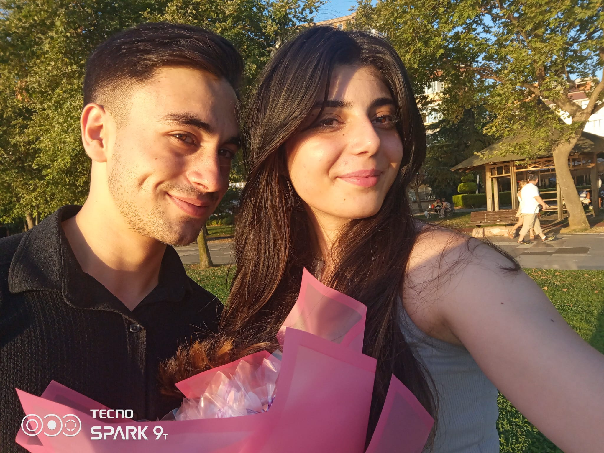
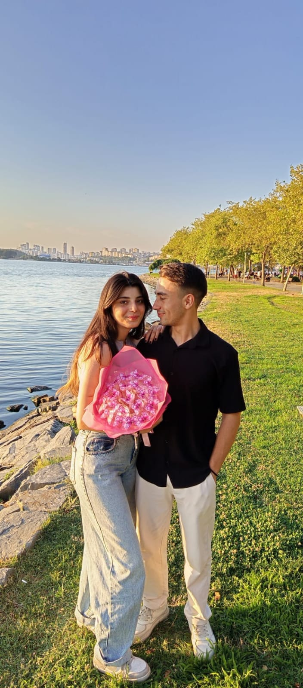
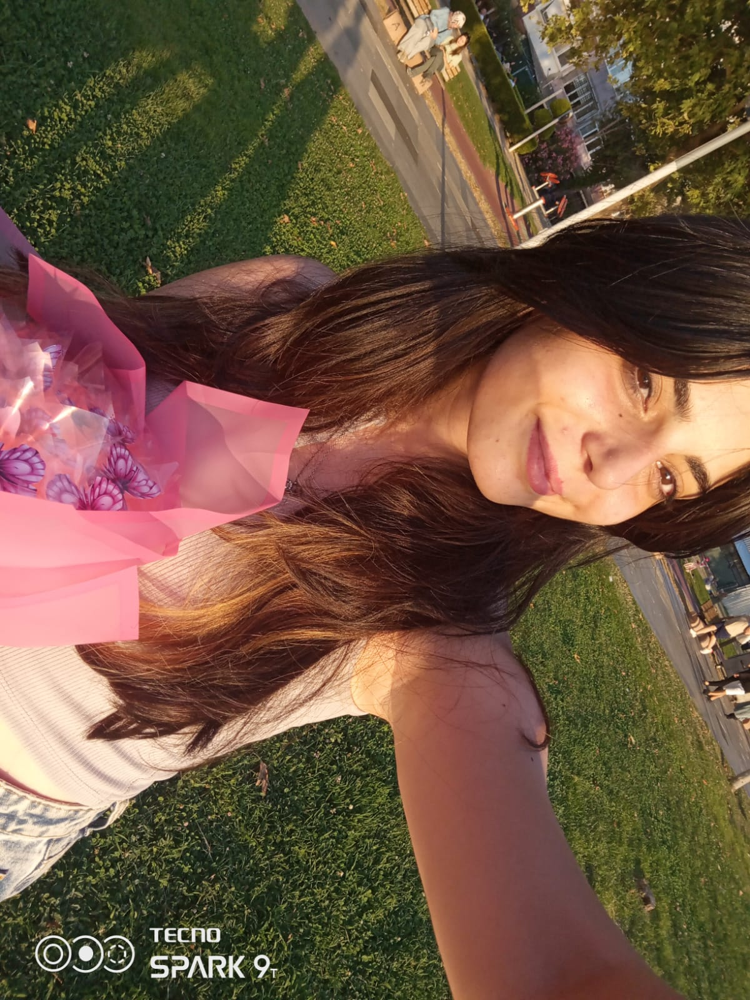

<!DOCTYPE html>
<html lang="tr">
<head>
  <meta charset="UTF-8">
  <title>Aleyna & Yasin – 7. Ayımız</title>
  
</head>
<body>

<header>
  <h1>7 Ay Oldu Aleyna ❤️</h1>
</header>

  

    
    
“Bu gülüş için dünyayı yakarım.”

  

  

    
    
“Sen yanımda ol, dünya umrumda değil.”

  

  

    
    
“Gözlerine bakınca tüm savaşlar duruyor içimde.”

  

  
📌 <strong>Tanışma Tarihimiz:</strong> 5 Kasım – Snapchat üzerinden, MSÜ Polislik hakkında konuştuk 👮‍♀️

  
📌 <strong>İlk Buluşmamız:</strong> 30 Aralık – Göz göze geldik, kalbimiz aynı anda attı 💞

  <h2>Seninle başlamak, en güzel karardı...</h2>
  
Aleyna,

  
O gün Snapchat’te yazdığında, konumuz sadece polislikti belki ama kalbim o andan itibaren farklı atmaya başladı. Senin sesin, bakışın, düşüncelerin… Hepsi içime işledi. Şimdi 7 ay sonra, dönüp baktığımda “iyi ki yazmışsın” diyorum. Çünkü o gün kader çizgim değişti.

  
  
Sana sadece aşık değilim, sana hayranım. Gücüne, kalbine, hayallerine. Seni sadece sevdiğim için değil, sana inandığım için yanındayım. Zor zamanlar yaşadık, yaşıyoruz… Ama asla yalnız değilsin. Bu yolda el ele yürüyoruz ve birlikte her şeyi aşacağız.

  
Sana her baktığımda huzur buluyorum. Kokunu düşündüğümde içim ısınıyor. Yanında olmadığım her saniye bile sana olan sevgimi azaltmıyor. Aksine daha da büyüyor.

  
Seninle sadece bu 7 ayı değil, kalan tüm ömrümü paylaşmak istiyorum. Ağladığında gözyaşlarını silmek, güldüğünde kahkahana ortak olmak, sustuğunda seni duymak istiyorum. Saçlarımız beyazladığında bile, aynı gözlerle bakmak istiyorum sana.

  
Seninle her anı paylaşmak, her gülüşünü görmek, her hayalini desteklemek için buradayım. Seninle birlikte yaşlanmak, hayatı seninle yaşamak istiyorum.

  
Bu 7 ay, sadece bir başlangıç. Daha nice aylar, yıllar ve anılar biriktireceğiz. Her anımızı değerli kılacağız. Seninle birlikte her şey daha güzel, daha anlamlı.

  
İyi ki geldin hayatıma. İyi ki varsın. Ve iyi ki biz olduk.

  
7. ayımız kutlu olsun Aleyna! ❤️

  
  
♥ Yasin

  <h2>💍 Küçük Bir Soru...</h2>
  
<strong>7li aylar değil… Saçlarımızın beyazlığına var mısın Aleyna?</strong>

  <button onclick="showHearts()">Evet, sonsuza dek!</button>

</body>
</html>
